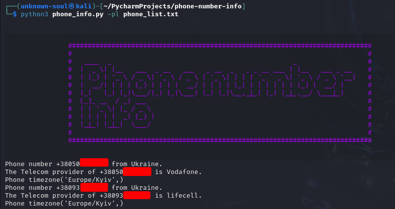

# About

Simple tool for phone number telecom provider and country check.

# How to install

* clone project with git clone https://github.com/TheUnknownSoul/phone-number-info.git
* install requirements from requirements.txt pip install -r requirements.txt

# How to use

Run for one number check ```python3 phone_info.py``` or ```python3 phone_info.py -pl phone_list.txt``` for list phone
check.

# Important

To check the info you need to enter phone in an international format. Example +441112223344